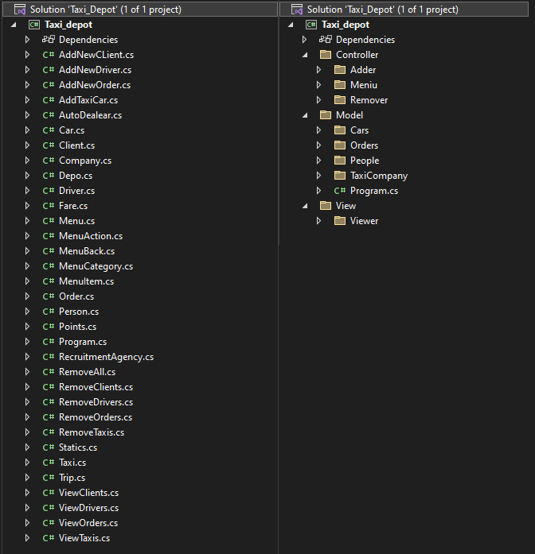

<h1> Lab 6 OOP
 Симуляция такси-компании</h1>

    <h3> Стуктура файлов </h3>
    С предыдущего момента (5th lab), файловая структура значительно изменилась и была доработана. Теперь все файлов классов лежат в соотвествующей папке с интуитивным названием.
    

          Было/стало:  
        
    

    <h3> Архитектура </h3>
    Не смотря на то, что на момент создания программы, я еще не был знаком с архитектурными паттернами, моя "архитектура" скорее была похожа и отдаленно напоминала <b> MVC </b> архитектуру.
    

        Естественно, чтобы не усложнять себе жизнь, решено было использовать именно этот подход и окончательно разделить данные приложения и управляющей логики на три отдельных компонента: модель, представление и контроллер — таким образом, что модификация каждого компонента может осуществляться независимо.
    

    <h3> Принципы SOLID и не только..</h3>
    Была проделана работа по натягиванию принципов SOLID на мое шайтан-приложение 😅
     
    Главной проблемой оказалось массовое наличие анти-паттерна GodObject, который решается первым принципом — <b> SRP </b>.
     
     
    Примеры:
    <ul>
        <li> класс <i> Points.cs </i> (было 167 строк) декомпозирован и "родил" еще два класса <i> Event.cs </i> и <i> GenerateOrders.cs </i>
        <li> класс <i> ViewOrders.cs </i> (было 110 строк) декомпозирован и "родил" еще один класс <i> EndDay.cs </i>
        <li> было удалено <b> 79 </b> строк ненужного кода, что улучшило читабельность кода
    </ul>
    

    <h3> Итого </h3>
    Получилось 36 классов и 1592 строки кода
     
    Убито множество нервов и получен? допуск до сессии
